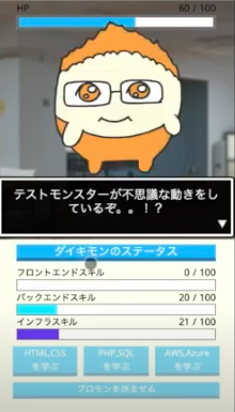

# テクモンアドベンチャー

* 制作期間: 7日間
* 使用言語: HTML,CSS,JavaScript, GoogleFireBase
* プロダクト紹介映像：
https://youtu.be/0sLqy5UFSpA

### 概要
「進化」をテーマにデジモン風の育成ゲームを作成しました。進化アクションや音声エフェクトをライブラリー使わずに全てゼロから実装したため、書いたコードが1000行を越え、可読性がめちゃくちゃ落ちました。。ですが、この経験を通じてデータベース、JS、HTMLの書き方を体感できたため、ここから自分でコードを書けるようになりました。

### 利用環境/再現手順

### 開発の苦労した点

